# DMV Rentals — Admin Operating Guide

A practical, day-to-day guide for the person running the DMV Rentals website. No coding
required. If you can use a web browser, you can operate the dashboard.

> **The one idea to remember:** this is an **approval** business, not an instant-booking
> one. Customers never pay or reserve anything automatically. Every request lands in a
> queue for **you** to review and approve or decline. Nothing happens on the road until
> you say so.

> **About the screenshots:** the images in this guide are captured from a demo
> environment — the names, licenses, plates, and figures shown are fictional sample data,
> not real customers. Your live dashboard will look identical but with your own data.

---

## 1. The two sides of the website

| Surface | Address | Who uses it |
| --- | --- | --- |
| **Public site** | `https://your-domain` (the home page) | Anyone. Browses the fleet, opens a vehicle, submits a booking **request**. |
| **Admin dashboard** | `https://your-domain/admin` | You and your team. Everything below happens here. |

Customers can create their own **renter account** to submit requests and track them. You
never manage customer passwords — they handle their own sign-in.

### What your customers see

It helps to know the journey that fills your review queue. This is the **public side** —
your customers never see the dark admin dashboard. (The customer site is shown in its
default **light** look below; your admin pages in this guide are shown in **dark** mode.)

**1. The fleet listing (home page).** Customers land here, filter by price/seats, and see
which cars are available. Every card leads to a request — there's no instant checkout.

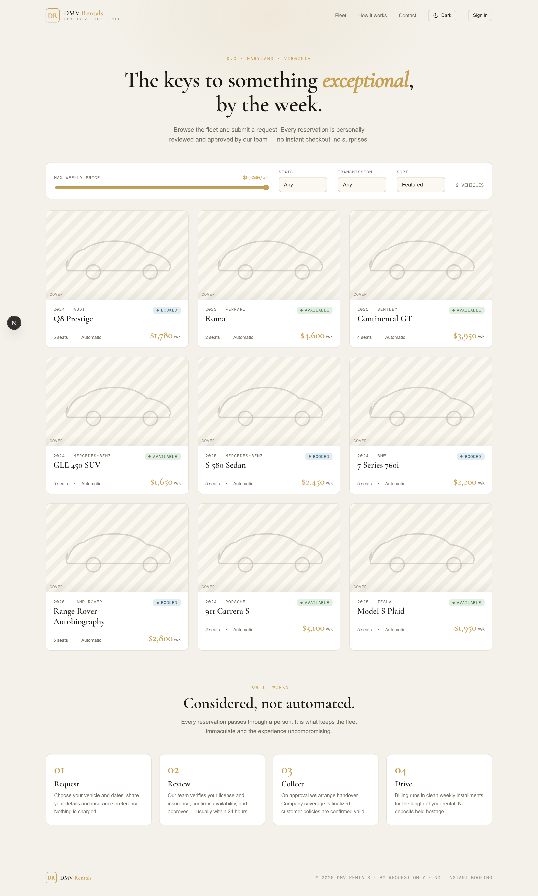

**2. A vehicle page.** Opening a car shows its photos, specs, and price, with a prompt to
request it for chosen dates.

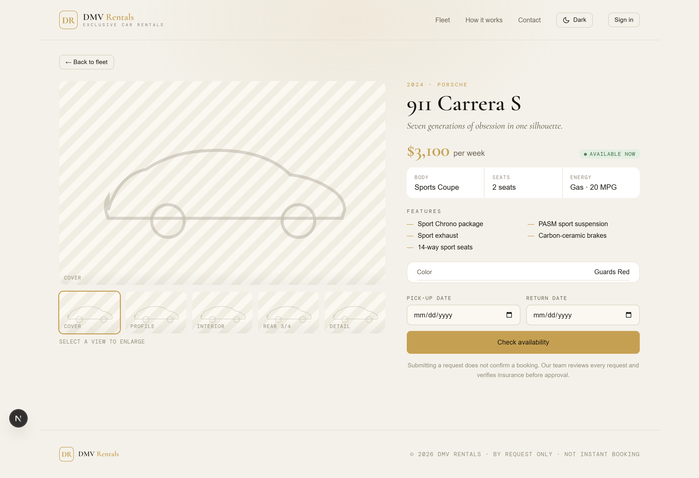

**3. The booking request wizard.** Signed-in renters pick dates, confirm driver and
insurance details, and review. The running total is clearly labelled **"Not charged at
request"** — submitting only creates the request that appears in your **Bookings** queue.

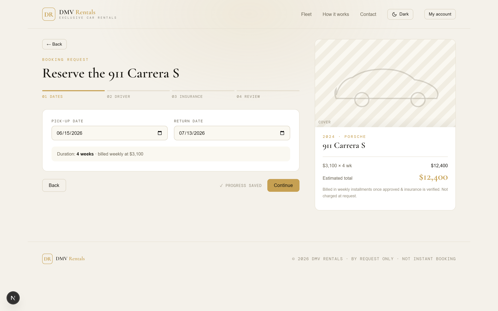

**"How it works" page.** A plain-language explainer of the request-and-approve model, so
customers know nothing is charged until you approve.

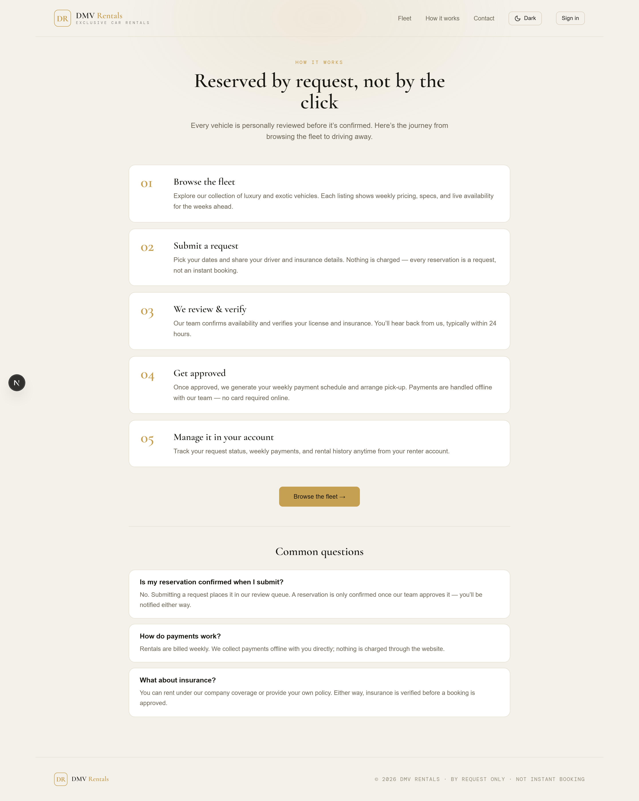

When a customer finishes that wizard, the request lands in your queue — which is where the
rest of this guide picks up.

---

## 2. Signing in

1. Go to **`/login`** (or click **Sign in** and choose staff).
2. Enter your work email and password.
3. You land on the **Overview** page.

Your name and role appear at the bottom-left of the sidebar. To **sign out**, use the
**⎋ Sign out** link there.

**Forgot your password?** You can't reset your own — ask another admin to reset it for you
from **Access control** (see §13). If you're the only admin, contact whoever set up the
site.

---

## 3. The dashboard at a glance

The left sidebar (under **OPERATIONS**) is your menu. Every page is one click away:

| Menu item | What it's for |
| --- | --- |
| **Overview** | Your morning dashboard — what needs attention today. |
| **Bookings** | The review queue. Approve, decline, and move rentals through their lifecycle. |
| **Messages** | Contact-form messages from the public site. |
| **Fleet Calendar** | Visual month view of which car is booked when. |
| **Renters** | Customer profiles, contact details, and driver-license documents. |
| **Insurance** | Verify or reject insurance policies attached to bookings. |
| **Payments** | The weekly payment schedule — mark payments as paid. |
| **Vehicles** | Your fleet — add, edit, photograph, retire cars. |
| **Automations** | Run the daily housekeeping jobs and see reminders they raise. |
| **Audit Log** | A permanent record of every important action and who did it. |
| **Access control** | Manage your team of admins (add, edit, reset password, remove). |

At the top-right there's a **search box** (reference, plate, or name) and a **light/dark
theme** toggle. **↗ View public site** (bottom-left) opens the customer-facing site in case
you want to see what customers see.

---

## 4. Your daily routine (the 5-minute version)

1. Open **Overview**. Scan the four number tiles at the top:
   - **Active Rentals** — cars currently on the road.
   - **Overdue Payments** — turns **red** when money is late. Chase these.
   - **Upcoming Payments** — due soon.
   - **Insurance Expiring** — turns **amber** when a policy expires within 14 days.
2. Work the **"Needs your review"** list — every new booking request. Click one to open it.
3. Check **Messages** for new customer enquiries.
4. Once a day, go to **Automations** and click **"Run daily jobs now"** (unless it runs
   automatically — see §12).
5. Handle anything the number tiles or reminders flagged.

That's the loop. The rest of this guide explains each area in depth.

---

## 5. Overview page

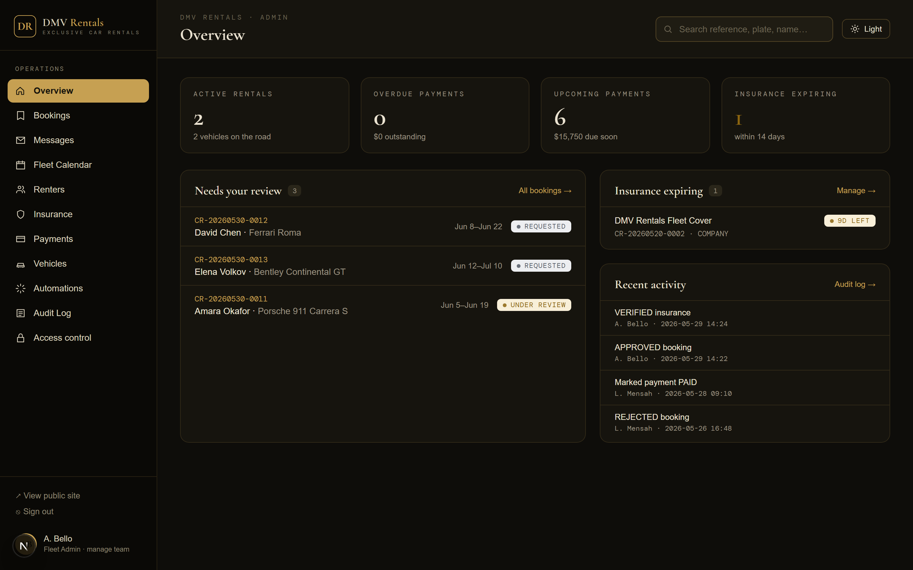

Read-only snapshot. It pulls together:

- **Four stat tiles** (described above).
- **Needs your review** — booking requests waiting on you. Click any row to open the
  booking. "Queue is clear" means nothing is pending.
- **Insurance expiring** — policies within 14 days of expiry, with days left. Click through
  to the Insurance page.
- **Recent activity** — the last few audited actions (who did what). Full history lives in
  the Audit Log.

Nothing here is an action button — it's your situational awareness. All the doing happens
on the pages it links to.

---

## 6. Bookings — the heart of the operation

This is where you approve or decline requests and move rentals through their lifecycle.

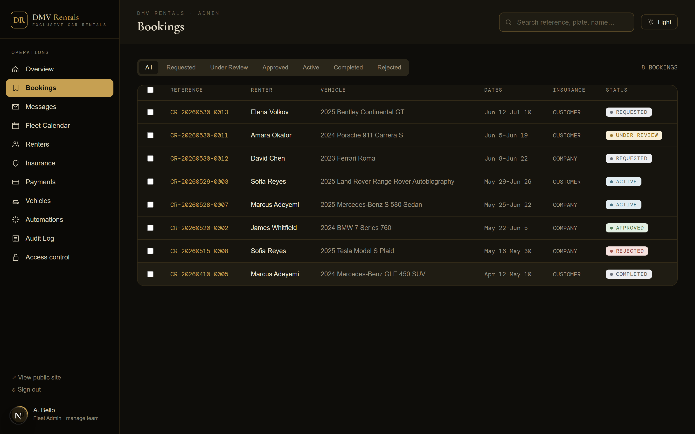

### The booking lifecycle

A booking moves through these stages, in order. The system **only lets you make legal
moves** — buttons for impossible steps simply don't appear.

```
REQUESTED → UNDER REVIEW → APPROVED → ACTIVE → COMPLETED
     └──────────┴──────────────→ REJECTED (a dead end)
```

| Stage | Meaning | What you can do |
| --- | --- | --- |
| **Requested** | Just submitted by a customer. | Start review, Approve, or Reject. |
| **Under review** | You're checking documents/dates. | Approve or Reject. |
| **Approved** | Confirmed and reserved. Dates are now blocked. | Mark active when the car is handed over. |
| **Active** | Car is with the customer. | Mark completed when it's returned. |
| **Completed** | Finished. | Nothing — it's history. |
| **Rejected** | Declined. Does **not** block the car's dates. | Nothing — it's a dead end. |

### The booking detail page

Clicking any booking opens its detail page — the timeline of where it is in the lifecycle,
the renter and their license, the insurance status, the vehicle, and the payment schedule.
The action buttons (**Approve / Reject**, or **Mark active / Mark completed**) sit in the
top-right and change depending on the stage.

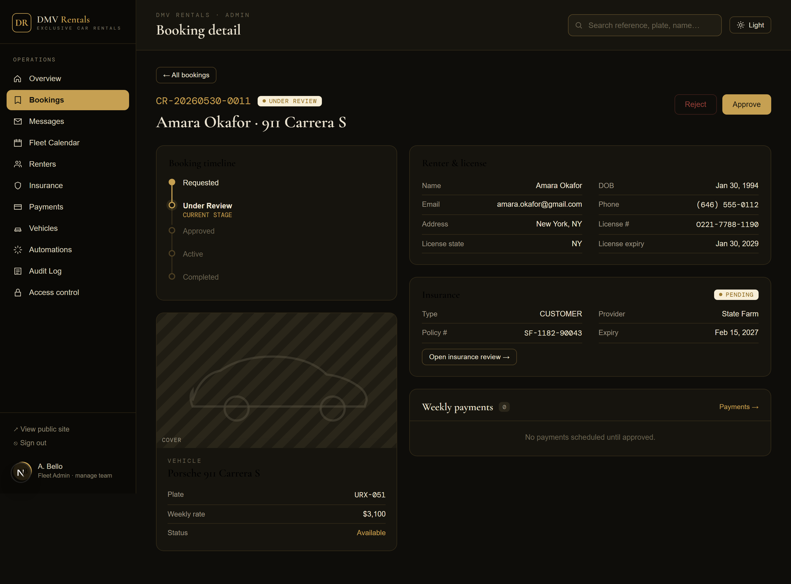

### Approving a request

1. Open the booking from the queue.
2. Click **Approve** → a confirmation box appears.
3. The box runs an **availability check** in real time:
   - **"No conflicts"** → the **Approve booking** button is active. Click it.
   - **"Date conflict — cannot approve"** → the button is disabled. Another approved or
     active booking already overlaps these dates. Resolve that first (see §16).

**What approval does automatically:**
- Reserves the car and **blocks those dates** against any other request.
- **Generates the weekly payment schedule** (visible on the Payments page).
- **Emails the customer** that they're approved (if email is configured — see §12).
- Writes an entry to the Audit Log.

### Declining a request

1. Click **Reject** → a box appears.
2. Enter an **internal reason** (e.g. "License expired", "Insurance not verified"). This is
   for your records; the customer is told they were declined.
3. Click **Reject booking**.

Rejecting does **not** block the car's dates — those dates stay open for other customers.

### Handing over and returning the car

- When the customer collects the car, open the approved booking and click **Mark active**.
- When they return it, click **Mark completed**.

### Bulk actions

On the Bookings list you can select several **requested / under-review** bookings and
approve or reject them together. The system still checks availability on each one and
**skips** any that would conflict — it tells you how many it applied and how many it
skipped.

---

## 7. Messages

Customer enquiries from the public **Contact** form land here.

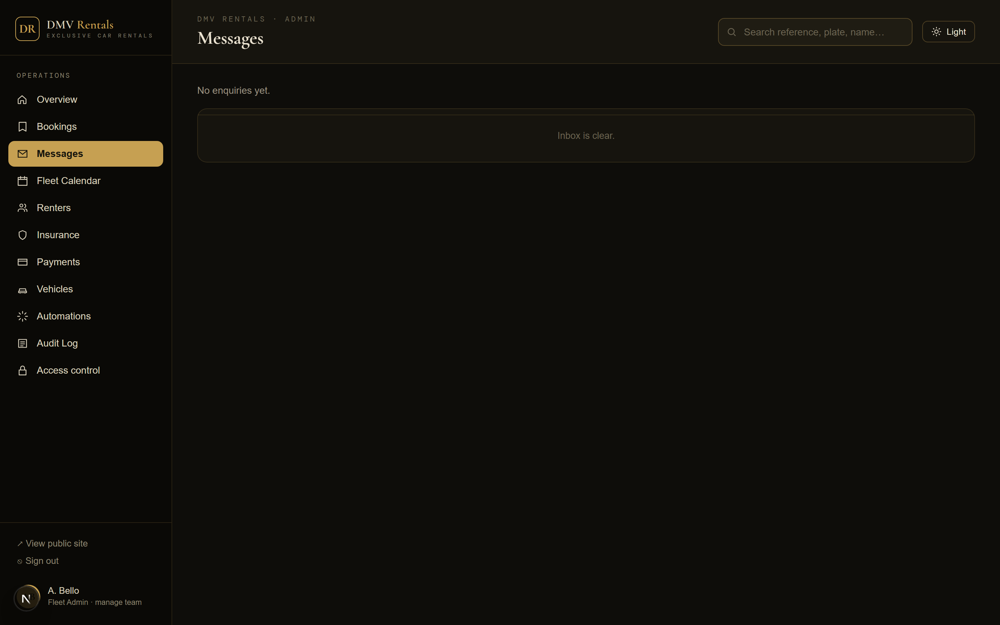

- New messages are marked **NEW**.
- Open one to read it; mark it **READ** once handled, or **ARCHIVED** to file it away.
- There is no reply-in-app feature — reply using the email/phone the customer provided,
  through your normal email.

---

## 8. Fleet Calendar

A month-by-month visual of the whole fleet: each car as a row, each booking as a bar across
the days it covers.

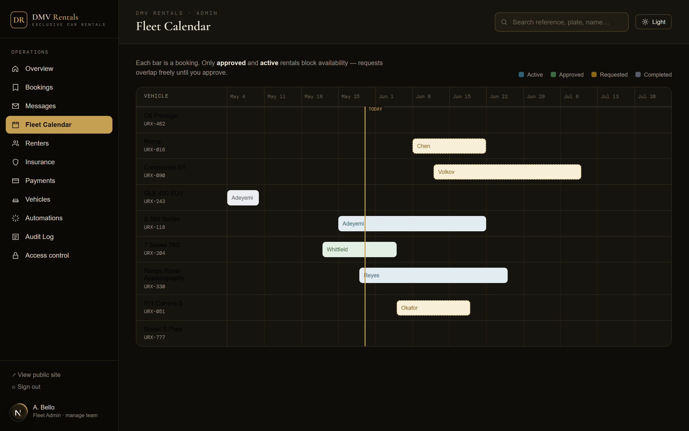
 Use it to spot gaps, avoid double-booking, and plan handovers at a
glance. It's a **view** — you approve and edit bookings from the Bookings page, not here.

---

## 9. Renters (customers)

The customer directory. Each profile holds contact details, booking history, and their
**driver-license documents** (front/back scans, number, state, expiry).

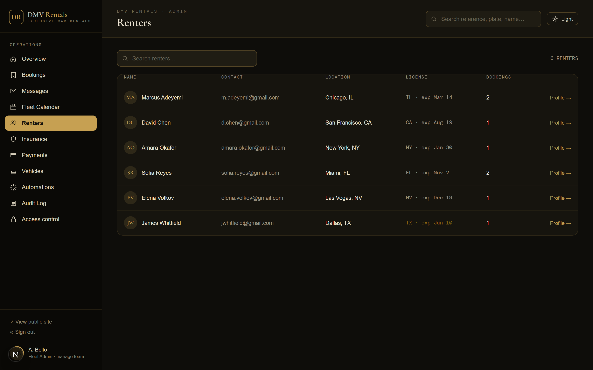

Click any renter to open their full profile:

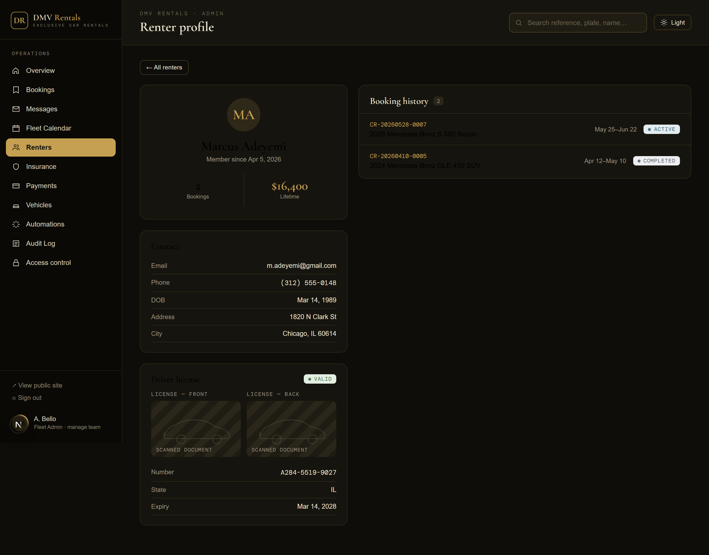

> ⚠️ **Privacy — treat this as sensitive personal data (PII).** Licenses and personal
> contact details are confidential. Only open them when you have a real business reason
> (verifying a booking), don't share them, and don't leave them open on a shared screen.

The system flags an **expired license** on the profile. Never approve a booking for a
customer whose license has expired.

---

## 10. Insurance

Every booking that needs insurance has a policy record here. Your job is to **verify** it
before money changes hands.

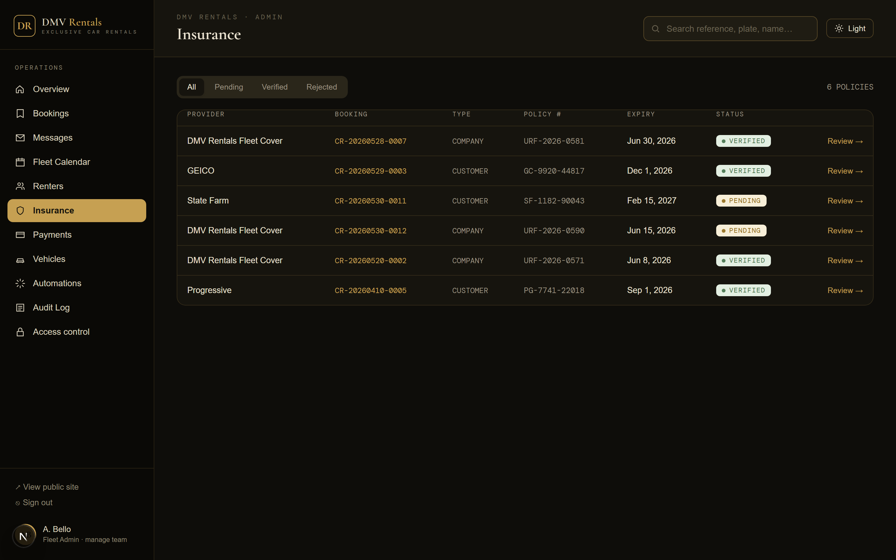

- **Verify** — you've confirmed the policy is genuine and current. Marks it **VERIFIED**.
- **Reject** — the policy is invalid/expired. Marks it **REJECTED**.
- **Edit** — correct provider name, policy number, expiry date, or agent contact details.

**Critical rule the system enforces:** for a company-insured booking, you **cannot mark its
payment as paid** unless the policy is **VERIFIED and not expired**. So: verify insurance
first, then take payment. If "Mark paid" refuses on the Payments page, come here and check
the policy.

Policies expiring within 14 days show up on the Overview and in Automations reminders.

---

## 11. Payments

The weekly payment schedule for every approved booking. Each row is one week's payment with
a status:

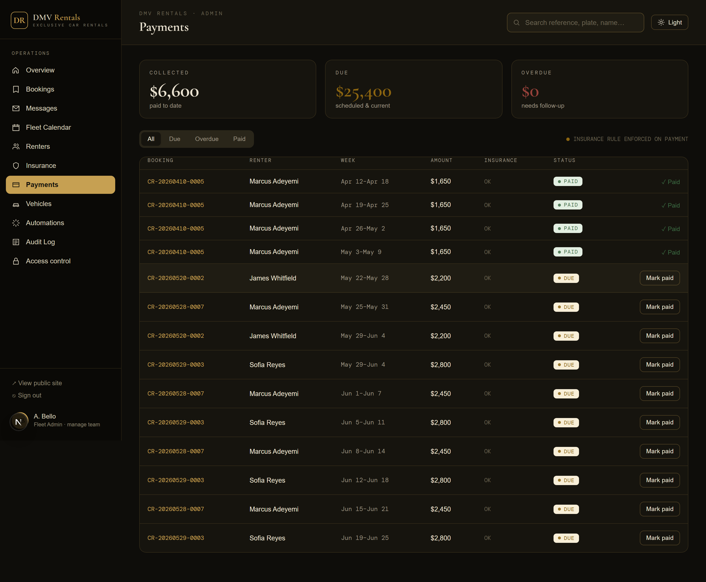

| Status | Meaning |
| --- | --- |
| **DUE** | Coming up / currently owed. |
| **PAID** | Money received and recorded. |
| **OVERDUE** | The week has fully passed and it wasn't paid. |

**To record a payment:** find the row and click **Mark paid**. The system stamps the date
and time automatically.

**If "Mark paid" is blocked:** the booking's insurance isn't verified (or has expired). Go
to **Insurance**, verify the policy, then come back. (See §10.)

You don't create these rows by hand — **approving a booking generates the whole schedule**
automatically.

---

## 12. Vehicles (managing the fleet)

Your car inventory. What the public sees on the site comes from here.

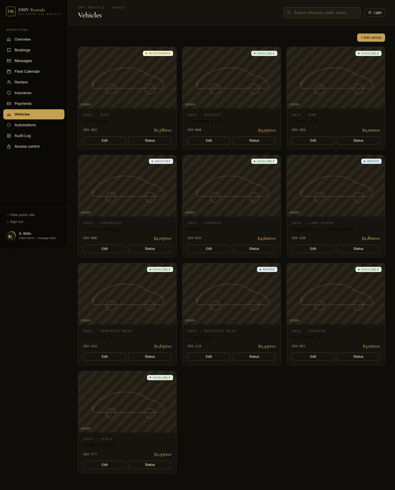

### Adding a car

Click **Add vehicle** and fill in make, model, year, weekly price, seats (color, VIN,
transmission optional). It's added as **AVAILABLE** with a placeholder plate. Add photos
next so it looks right on the public site.

### Photos

Each car has up to five photo slots: **cover, profile, interior, rear, detail**. Upload an
image to a slot, nudge its position if needed, or remove it. The **cover** shot is what
customers see first in the fleet listing — make it a good one.

### Editing a car

You can change the **weekly price, color, VIN**, and toggle whether the **body type, seats,
and energy/fuel** specs are shown publicly. (Make/model/year are set at creation.)

### Car status

| Status | Effect |
| --- | --- |
| **Available** | Bookable by customers. |
| **Rented** | Currently out. |
| **Maintenance** | Hidden from booking — **not available** even if dates are free. |
| **Archived** | Retired from the fleet, hidden from the public site. |

Use **Maintenance** for servicing/repairs so nobody can book a car that's in the shop.

### Retiring a car — Archive vs Delete

- **Archive** — the safe, normal way to retire a car. Removes it from the public fleet but
  keeps all its records. **Use this by default.**
- **Delete** — only for cars with no history. The system **blocks deletion while any live
  booking references the car** (it tells you to archive instead). A car that has past
  bookings is kept as a hidden "(Deleted)" record so old booking history still reads
  correctly. A car never booked is fully removed.

**When in doubt, Archive.** You can't accidentally destroy booking history that way.

---

## 13. Automations (daily housekeeping)

The system does routine bookkeeping so you don't have to. Clicking **"Run daily jobs now"**
(or the automatic schedule) does three things:

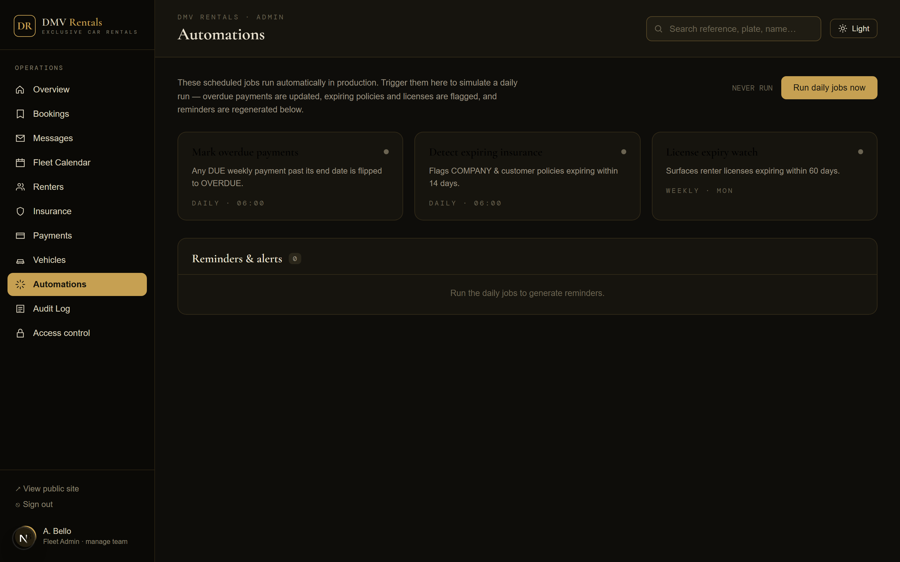

1. Marks **DUE payments OVERDUE** once their week has fully passed.
2. Flags **insurance expiring within 14 days** and **driver licenses expiring within 60
   days**.
3. Regenerates the **reminders** list you see on this page.

The page shows the **last run time** and all current reminders (high/low severity). Running
it again is always safe — it just re-checks the current state.

**Does it run on its own?** On the live site, yes — a scheduled job runs it **once a day
automatically** (configured during setup). The manual button is there for when you want to
refresh things immediately. If you're ever unsure whether it ran, just click it.

---

## 14. Audit Log

A permanent, read-only record of every important action: approvals, rejections, payments,
insurance decisions, vehicle changes, and team changes — each with **who did it and when**.

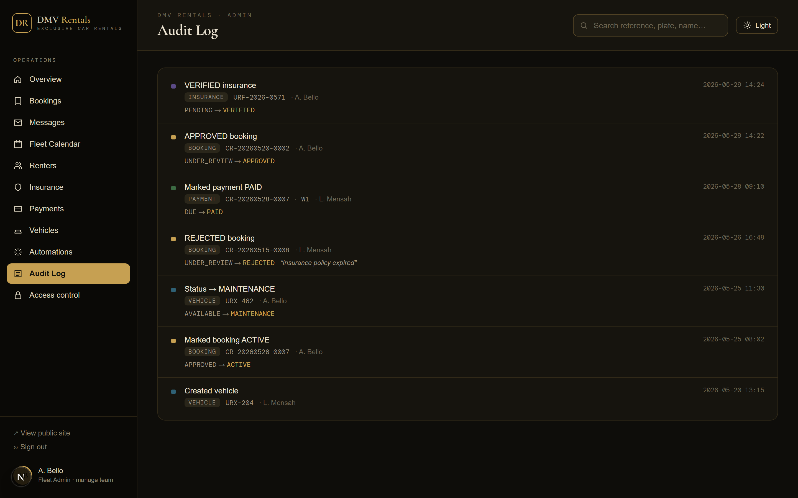
You can't edit or delete entries. Use it to answer "who changed this, and when?" and for
accountability. This is your source of truth in any dispute.

---

## 15. Access control (managing your team)

Manage the other admins who can log in. **Only admins can see this page.**

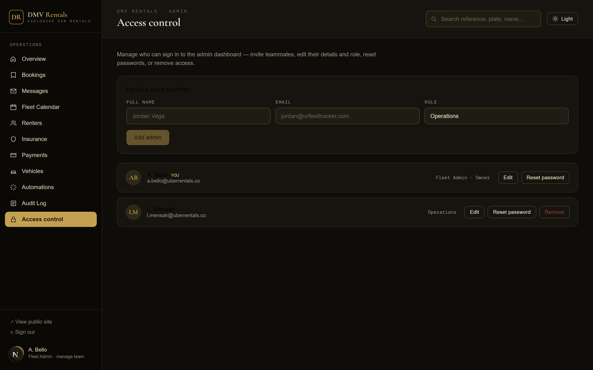

- **Add admin** — enter name, email, role. The system generates a **one-time temporary
  password shown to you once**. Copy it and give it to the new admin securely (in person or
  via a secure channel — not a public email thread). They sign in with it and you should
  have them change it.
- **Edit** — update a teammate's name, email, or role.
- **Reset password** — set a new password for a teammate who's locked out (minimum 8
  characters). Share it securely.
- **Remove** — delete an admin. Safety rails: you **can't remove your own account**, and
  the system **won't let you remove the last remaining admin** (someone must always be able
  to log in).

Every change here is written to the Audit Log.

---

## 16. Common situations & troubleshooting

**"I can't approve a booking — it says there's a date conflict."**
Another **approved or active** booking already overlaps those dates. Only one can have the
car. Open the Fleet Calendar or Bookings to see which one, and either decline the new
request or resolve the existing booking first. (Requests that are still just *requested*
don't block each other — conflicts only apply once a booking is approved/active.)

**"'Mark paid' won't work."**
The booking's insurance isn't **verified**, or the policy has expired. Go to **Insurance**,
verify (or fix) the policy, then mark the payment paid.

**"I can't delete a car."**
It has live bookings. **Archive** it instead — same effect (off the public site), without
destroying records.

**"A customer says they were approved but didn't get an email."**
Approval emails are best-effort and depend on email being configured on the server. The
approval itself still went through — check the booking's status in the dashboard, which is
the source of truth. If emails never arrive for anyone, ask your technical contact to check
the email settings.

**"I forgot my password."**
Another admin resets it from **Access control**. If you're the only admin, contact whoever
set up the site.

**"The dates/'today' look wrong in a demo."**
On the live site the app uses the real calendar date. A fixed demo date is only used in
test setups.

---

## 17. Golden rules

1. **Approve deliberately.** Approval reserves the car, blocks the dates, and starts the
   payment clock. Check dates, license, and insurance first.
2. **Verify insurance before you take payment.** The system enforces this — don't fight it.
3. **Archive, don't delete.** Preserve history.
4. **Use Maintenance status** for cars that shouldn't be booked (servicing, repairs).
5. **Protect customer data.** Licenses and contact details are private. Access only with a
   reason.
6. **The Audit Log sees everything.** Work openly; it's there to protect you and the
   business.

---

*Questions this guide doesn't answer, or something behaving unexpectedly? Note the booking
reference or car plate and the time, then contact your technical administrator — the Audit
Log will have a record of what happened.*
